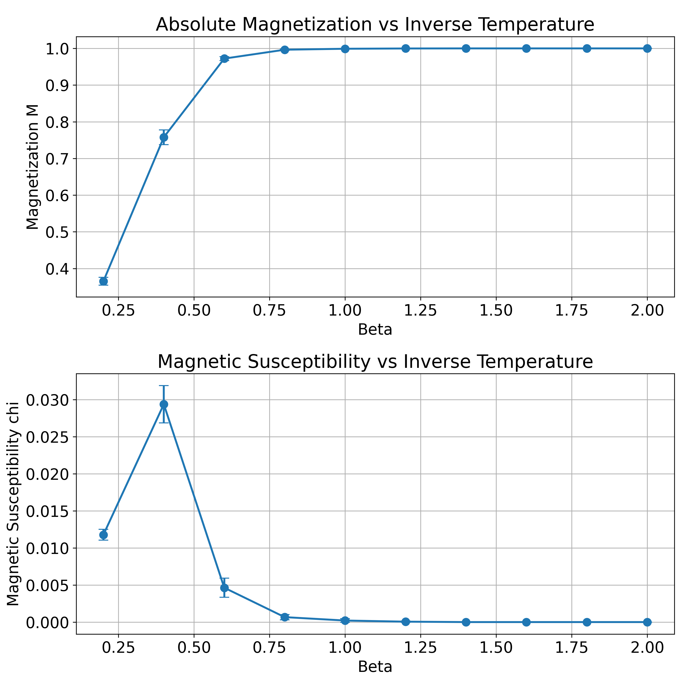

# Molecular Modeling Projects

This repository contains three Python object-oriented projects developed as part of the Molecular Modeling course at the University of Warsaw.


## 1. Ising Model Simulation

The Ising model simulation project aims to model the behavior of a 2D Ising model using Monte Carlo methods. The code implements the Metropolis algorithm to simulate the evolution of spins on a lattice. The resulting figure visualizes the magnetization of the system as a function of temperature.

## 2. Planet-Sun System Simulation

The Planet-Sun system simulation project focuses on simulating the motion of a planet around a central sun using different integrative algorithms: Verlet, Leap-Frog, and Euler. Each algorithm is implemented as a separate Python class. The resulting figures provide visual comparisons of the trajectories generated by each algorithm.

- **Verlet Algorithm**: A symplectic integrator commonly used in molecular dynamics simulations.
- **Leap-Frog Algorithm**: A second-order numerical integration method known for its stability and accuracy.
- **Euler Algorithm**: A simple but less accurate integration method commonly used for educational purposes.

## 3. Molecular Dynamics of Random Walk

The Molecular Dynamics of Random Walk project simulates the behavior of particles in a box with periodic boundary conditions and a thermostat. The particles undergo random walks within the box, and the thermostat ensures temperature control. This project provides insights into the diffusion behavior of particles in confined environments.

- Molecular dynamics simulation using the leapfrog integration scheme.
- Periodic boundary conditions to simulate an infinite system.
- Calculation of interatomic forces using Lennard-Jones potential.
- Energy calculations including kinetic energy, potential energy, and total energy.
- Trajectory plotting and animation.
- Exporting simulation frames to create an animation.


Each project is implemented in Python, following an object-oriented programming paradigm, making it easy to understand, modify, and extend.

## Requirements

- Python 3.x
- NumPy
- Matplotlib
- tqdm (for progress bars)

## Usage

Each project directory contains the Python script for running the simulation and generating the figures. Simply navigate to the desired project directory and execute the script using a Python interpreter.

```bash
python ising_model_simulation.py
python planet_sun_simulation.py
python molecular_dynamics_random_walk.py

## License

This project is licensed under the [GNU General Public License](LICENSE) - see the [LICENSE](LICENSE) file for details.
